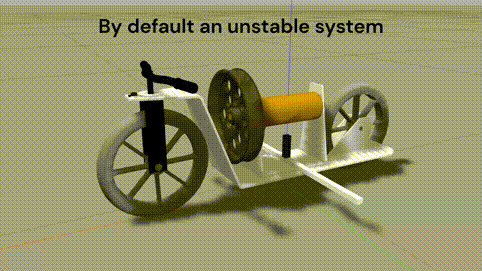
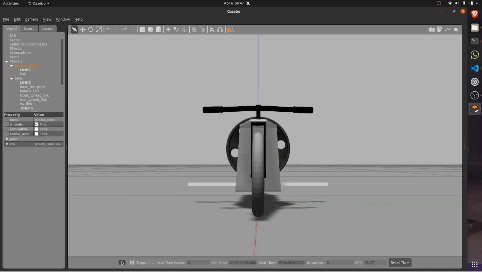
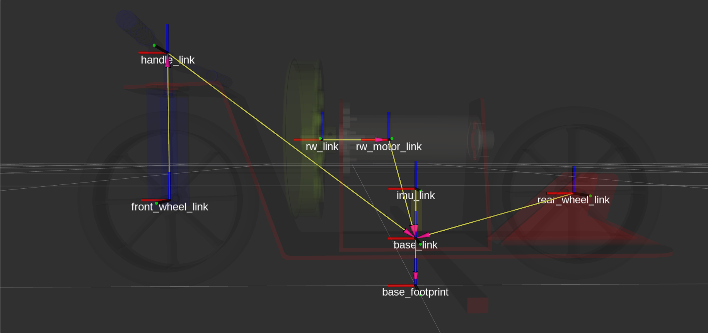

# Reaction wheel Bike
The bike is designed by assembling different parts, taken from different sources and some were built explicitly. This ros package tries to demonstrate the balancing of a two wheeled bike in ros-noetic using a reaciton wheel.

## Software Requirements
 - ubuntu 20.04
 - git
 - ros-noetic-desktop-full

## Installations/setup

### 1. Create a ros package using following commands : 
```
cd ~
mkdir -p catkin_ws/src
cd catkin_ws
catkin_make
```

### 2. Make sure to source your ros repo using this command : 
```
echo "source ~/catkin_ws/devel/setup.bash" >> ~/.bashrc

```


### 2. Clone this ros package in your local ros workspace :
```
cd ~/catkin_ws/src
git clone git@github.com:ab31mohit/self_balancing_bike.git
cd ..
catkin_make
```

## Usage 

### Run the following command to launch the bike in gazebo and start balancing.
```
roslaunch self_balancing_bike empty_world_urdf.launch
```  

| (Without balancing the bike)                  |     Balancing bike at a point                    |
|-------------------------------------------|----------------------------------|
|         |              


These are the frames attached to different portions of the bike
   
<div align="center">
  
</div>

You can launch the `rviz.launch` file to visualize these frames.
